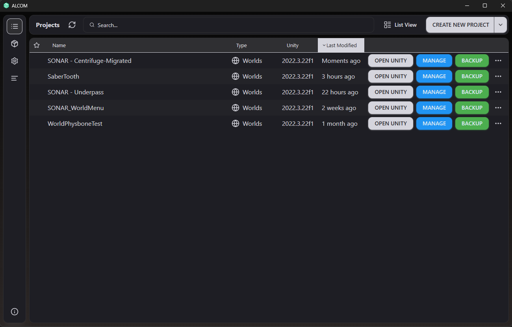

# Creating VRSL Worlds
In this document, we will guide you through the process of creating VRSL-compatible worlds for VRChat. This includes setting up the necessary components, configuring DMX fixtures, and optimizing performance for a smooth user experience.

## Prerequisites
Before you begin, ensure you understand how VRSL worlds and have completed the [Getting Started](docs/gettingStarted.md) guide.

I will be assuming that you have basic knowledge of Unity and VRChat world creation. If you do not, please make yourself familiar with those topics first.
I will also be assuming you have Unity installed and set up for VRChat world creation. If you have not done this yet, please refer to the [VRChat documentation](https://docs.vrchat.com/docs/setting-up-the-sdk) for guidance.

## ALCOM vs VCC
I'm just gonna throw this in here real quick. The VCC (VRChat Creator Companion) program is the official way to create content for VRChat, including worlds and avatars. It provides access to the VRChat SDK, which is necessary for uploading content to the platform. **But** with 100% honesty, ALCOM does it better. ALCOM is an alternative Companion allows you to do the same thing, but with better performance and stability. It is what I personally recommend using for all of your VRChat content creation needs, including VRSL worlds.

You can download ALCOM [here](https://vrc-get.anatawa12.com/en/alcom/).